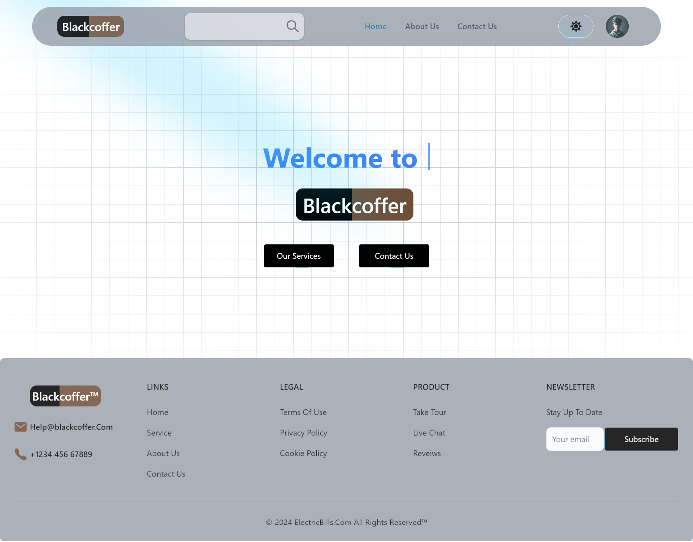
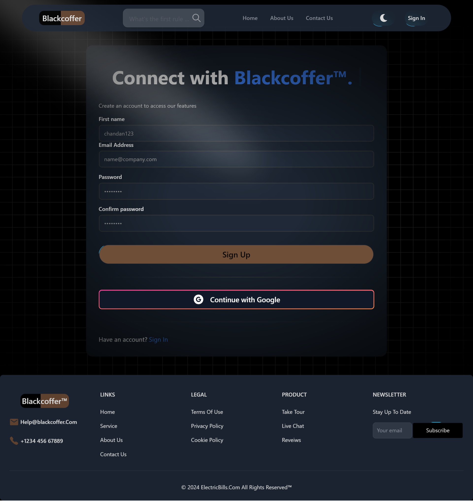
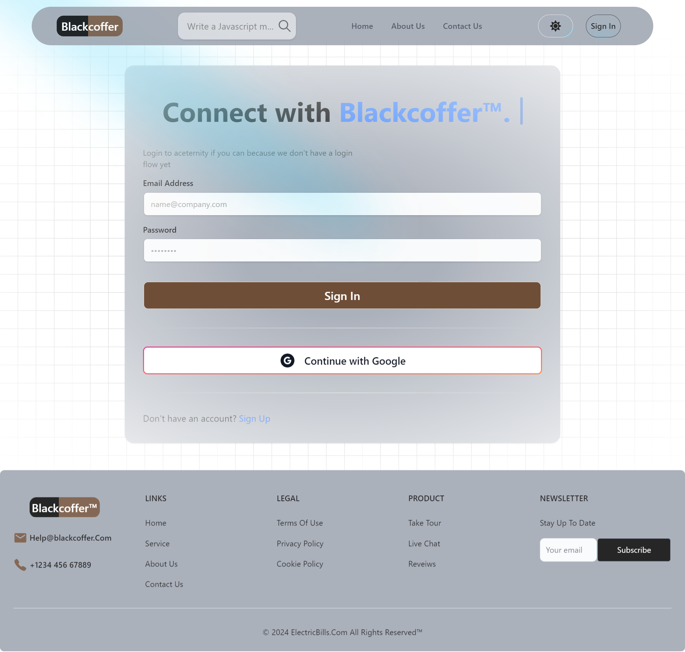
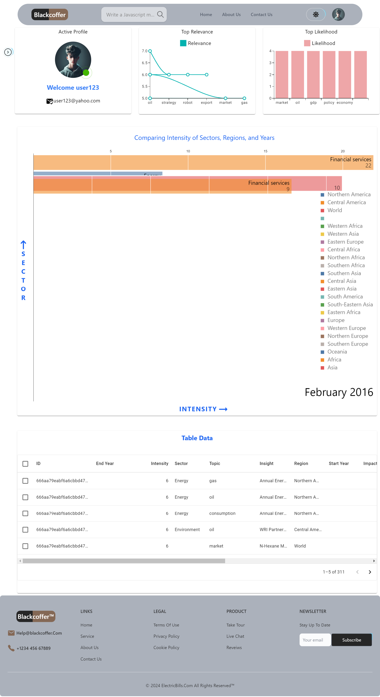
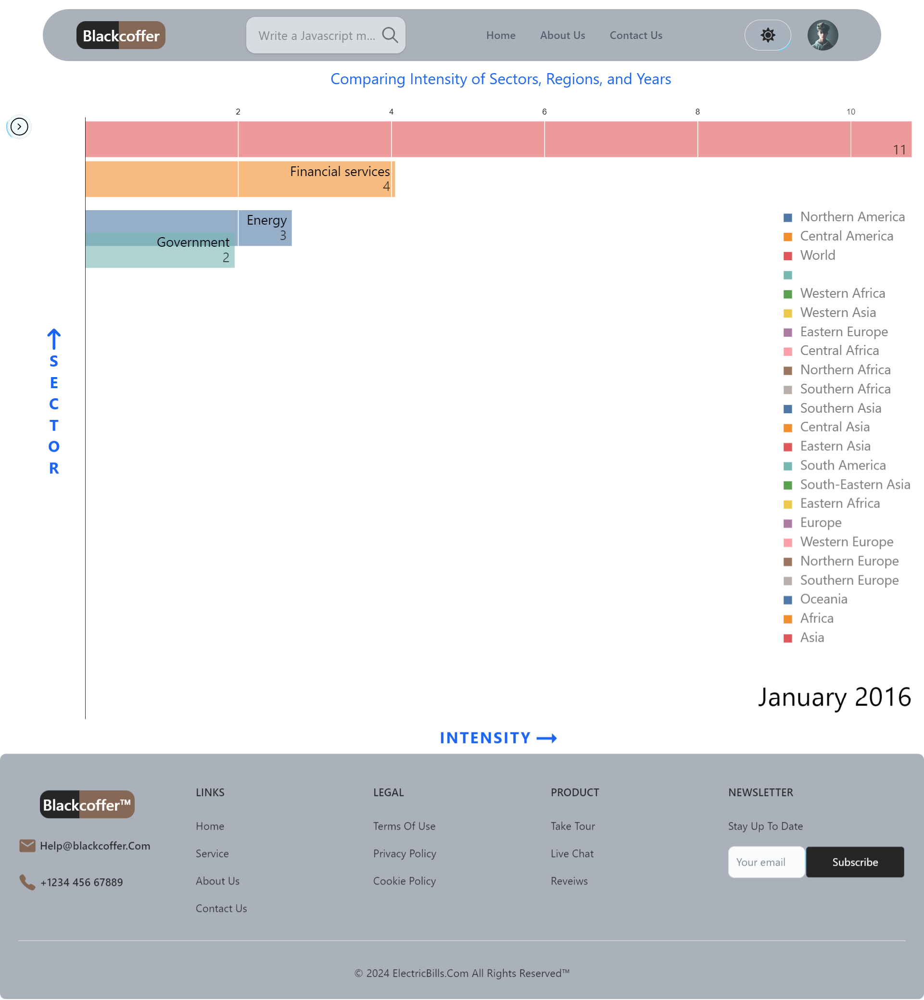
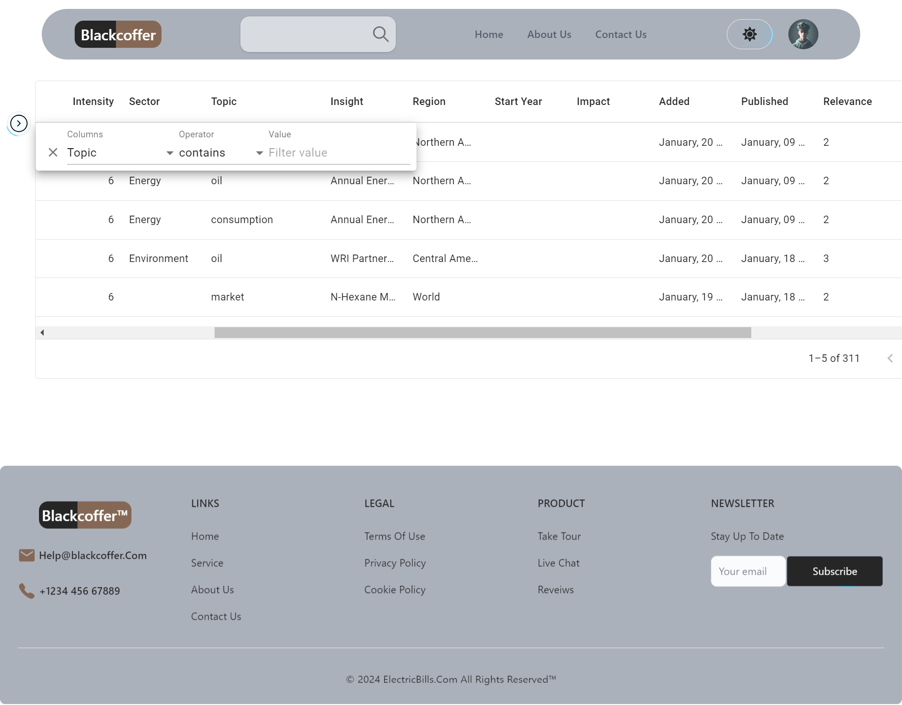
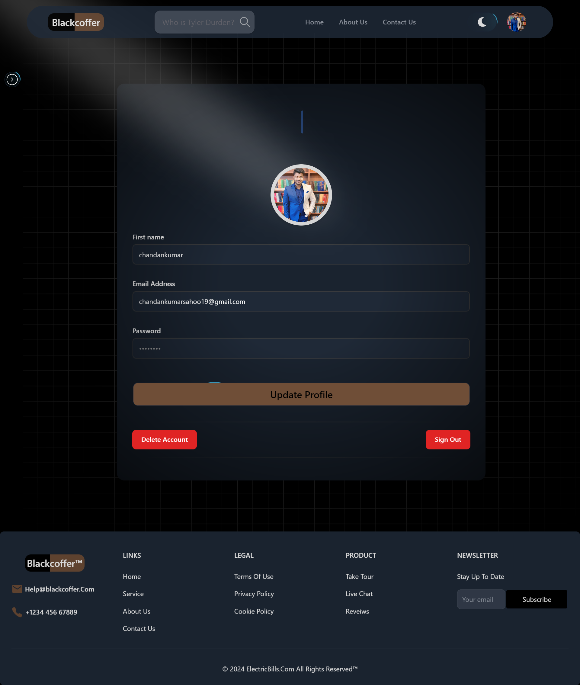

# BlackCoffer Assignment

Welcome to the BlackCoffer Assignment project! This project is designed to showcase a web application built with modern technologies including React, Redux, Tailwind CSS, and more. The application features user authentication, a private route system, and a beautiful, responsive design.

## Table of Contents

- [Features](#features)
- [Demo](#demo)
- [Installation](#installation)
- [Usage](#usage)
- [Folder Structure](#folder-structure)
- [Technologies Used](#technologies-used)
- [Contributing](#contributing)

## Features

- **User Authentication**: Secure login and registration with Redux state management.
- **Private Routes**: Protected routes that are accessible only to authenticated users.
- **Responsive Design**: Mobile-first design using Tailwind CSS.
- **Interactive UI**: Smooth animations using Framer Motion.
- **Reusable Components**: Modular and reusable React components.

## Demo


---

---

---

---

---

---

---


## Installation

To run this project locally, follow these steps:

1. **Clone the repository**:
    ```sh
    git clone https://github.com/yourusername/chaintechassignment.git
   
    ```

2. **Install dependencies for backend**:
    ```sh
    npm install
    ```

2. **Start the backend server**:
    ```sh
    npm run dev
    ```

3. **Install dependencies for frontend**:
    ```sh
    cd frontend
    npm install
    ```
4. **Start the backend server**:
    ```sh
    npm run dev
    ```

## Usage

Once the server is running, you can visit the application at `http://localhost:7979`. You can navigate through different pages such as Home, Services, About, Contact, Sign In, and Sign Up. Authenticated users can access the Dashboard.

### Home Page

The Home Page is designed to welcome users with an attractive gradient background and interactive elements. It includes links to services and contact pages.

### Sign In / Sign Up

Users can sign in or register for a new account. These forms handle user input and manage state using Redux.

### Dashboard

Accessible only to authenticated users, the Dashboard displays user-specific information and actions.

## Folder Structure

```sh
.
├── public
├── src
│   ├── components
│   │   ├── footer
│   │   │   └── FooterComp.jsx
│   │   ├── header
│   │   │   └── Header.jsx
│   │   ├── privateroute
│   │   │   └── PrivateRoute.jsx
│   │   ├── ui
│   │   │   └── Various UI Components
│   ├── pages
│   │   ├── About.jsx
│   │   ├── Contact.jsx
│   │   ├── Dashboard.jsx
│   │   ├── Home.jsx
│   │   ├── Service.jsx
│   │   ├── SignIn.jsx
│   │   └── SignUp.jsx
│   ├── redux
│   │   ├── theme
│   │   │   └── themeSlice.js
│   │   └── user
│   │       └── userSlice.js
│   ├── App.jsx
│   ├── main.jsx
│   └── index.css
├── .eslintrc.js
├── .gitignore
├── package.json
├── README.md
└── tailwind.config.js
